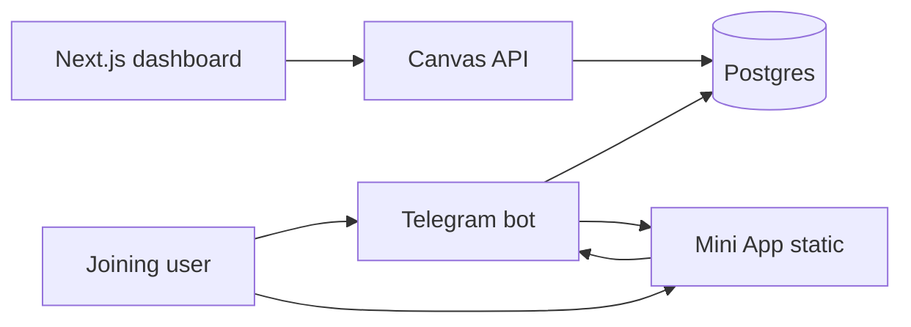

# Canvas AI — Advertiser Dashboard MVP Plan

> Hybrid roadmap: Telegram bot ships tasks today; web dashboard is the advertiser design studio for templates and campaigns.  
> **Telegram limits & API links:** [`TELEGRAM_API.md`](./TELEGRAM_API.md) · [Bot API](https://core.telegram.org/bots/api) · [Mini Apps](https://core.telegram.org/bots/webapps)

## Goal

Give advertisers a visual workspace to create verification templates, preview how they appear in Telegram, fund campaigns, and monitor performance — without requiring Telegram DM commands for every change.

## Users

| Role | Dashboard needs |
|------|-----------------|
| Advertiser | Template library, campaign CRUD, bid management, budget view, daily stats |
| Group owner | Read-only earnings + verification volume (v2) |
| Canvas admin | Moderation, Kimi threshold tuning, group health |

## MVP scope (2–3 weeks)

### 1. Template CRUD

**Table:** `task_templates` (already in schema)

| Field | Purpose |
|-------|---------|
| `name` | "Moonwell yield preference" |
| `task_type` | `open_text`, `trivia_mc`, `preference_mc`, `preference_webapp` |
| `payload` | JSON: prompt, options, descriptions |
| `preview_image_url` | Screenshot for template picker |

**UI pages:**
- Template list (grid of cards with preview)
- Template editor (form per type)
- Live preview pane (renders Telegram-style mock)

**Template types at launch:**

| Type | Editor fields | User sees |
|------|---------------|-----------|
| `open_text` | Prompt text | DM text reply → Kimi score |
| `preference_mc` | Prompt + 2–4 options with descriptions | Inline buttons in DM |
| `preference_webapp` | Prompt + options + optional brand color | [Mini App](https://core.telegram.org/bots/webapps) button → rich cards |

### 2. Campaign management

Link templates to `advertiser_budgets`:

```
advertiser_budgets.template_id → task_templates.template_id
```

**Campaign create flow:**
1. Pick template (or duplicate existing)
2. Pick target group(s)
3. Set bid + quantity
4. Confirm → `placeBid()` + escrow deposit (when wired)

**Campaign list view:**
- Active / paused / exhausted status
- Remaining budget, bid rank, completions today

### 3. Preview system

Split preview by delivery channel:

- **Chat preview:** Static component matching [captcha-dm.ts](../src/telegram/services/captcha-dm.ts) output
- **Mini App preview:** iframe to `/mini-app/preference.html` with query params ([WebApp init](https://core.telegram.org/bots/webapps#initializing-mini-apps))

### 4. Auth

v1 options (pick one):

| Option | Pros | Cons |
|--------|------|------|
| Telegram Login Widget | Matches advertiser TG identity | Extra OAuth flow |
| Wallet signature (SIWE) | Onchain-native | Heavier UX |
| Magic link to advertiser_tg_id | Simplest | Weak security |

**Recommendation:** Telegram Login Widget → store `advertiser_tg_id` in session → match `advertiser_budgets.advertiser_tg_id`.

### 5. API layer (new)

Express routes or separate Next.js API:

```
GET  /api/templates
POST /api/templates
GET  /api/campaigns
POST /api/campaigns        → placeBid()
GET  /api/groups           → listActiveGroups()
GET  /api/stats/:campaignId
```

Bot continues to resolve tasks from DB at join time — dashboard writes, bot reads.

## Architecture



## Tech stack recommendation

| Layer | Choice | Rationale |
|-------|--------|-----------|
| Frontend | Next.js 15 + Tailwind | Matches HTML mockups, fast forms |
| API | Extend existing Express in [bot.ts](../src/telegram/bot.ts) or Next API routes | Reuse Postgres adapters |
| Auth | Telegram Login Widget | Advertisers already on Telegram |
| Preview | React components mirroring bot message format | WYSIWYG confidence |

## Out of scope for MVP

- Drag-and-drop visual editor (use structured forms first)
- Multi-group campaign bundles
- Real-time analytics charts
- Escrow deposit UI (manual until Bankr wired)
- Group owner dashboard

## Milestones

| Week | Deliverable |
|------|-------------|
| 1 | `task_templates` CRUD API + seed templates; bot reads `template_id` from campaign |
| 2 | Dashboard template list + editor + chat preview |
| 3 | Campaign create flow + link to `/buy` parity; Mini App preview |

## Success criteria

- Advertiser creates a preference template in dashboard, funds campaign, new joiner sees that task within 60 seconds
- No code deploy needed to change task copy (DB-driven)
- Preview matches actual Telegram DM within 1:1 text/layout parity for chat types

## Files to add (when building)

```
dashboard/
  app/
    templates/page.tsx
    templates/[id]/edit/page.tsx
    campaigns/page.tsx
    campaigns/new/page.tsx
  components/
    TemplatePreview.tsx
    PreferenceMcPreview.tsx
src/adapters/templates.adapter.ts
src/api/templates.router.ts
src/api/campaigns.router.ts
```

## Current bot integration points

| File | Role |
|------|------|
| [verification-tasks.ts](../src/services/verification-tasks.ts) | Task resolution priority |
| [begin-verification.ts](../src/telegram/services/begin-verification.ts) | Sends resolved task at join |
| [buy.ts](../src/telegram/handlers/buy.ts) | Telegram-native campaign create (keep as fallback) |
| [public/mini-app/preference.html](../public/mini-app/preference.html) | Rich template delivery |
| [docs/TELEGRAM_API.md](./TELEGRAM_API.md) | Bot API mapping + customization limits |
